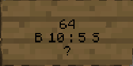

# Capitalism

Basic documenation and usage guide.

## Quick start
The goal is to be the first to reach **$1,000,000,000**.
The first time you connect, you will recieve **$1,000,000**.

There are a few ways to make money, they go as follows.
## Shops
If you buy an area of land (in the shop district) and decide to put a sign with a specific format on a chest, you can sell in-game items to other players for a set price.


## Playtime rewards
Every ~25 minutes, the server broadcasts a playtime reward. If you click the message, you get **$100,000**. You have 30 seconds to click the message, else it expires.

## Lottery
Everyday, at around 5-6PM minutes, the server broadcasts a lottery. If you click the message, you are entered. You also get notified about an active lottery whenever you log in. The maximum amount of money that a lottery can give is **$1,000,000**. Details about how the amount of money in a lottery is determined later.

# Specifics
More specific information.

## Commands
### /balance
Can also be typed as
 - bal

This will display how much money you have. Example:


### /pay
Can also be typed as
 - send
 - transfer

This command can be used in one of two formats.
 - /pay \<player> \<amount>
 - /pay \<amount> \<player>

A successful transaction looks like this


The text in brackets (in this case: `(ba7b)`), is the *transaction hash*. As the recipient of the money is not told who sent it, this hash is shared between both clients, so it can be used to confirm if someone sent you a transaction.

There are a few errors that can happen when trying to send someone money, the most common error is this


This means you don't have enough money to send to the specific player. But other errors include but are not limited to:
 - Sending money to yourself
 - Sending money under $1
 - General database issue
 - Causing a flag in anti money duplication systems

Please note that you cannot view the balance of another player.

## The Lottery
The server stores it's own bank account. This bank account is sent money from Death Tax, Transaction Tax, and property sales.

Everyday, **at around 5-6PM AEST**. The lottery will randomly select a winner out of the people who have entered. **You need to be online when it rolls for it to select you, it does NOT select an offline player**.

A roll is skipped if
- Less than 2 people rolled
- No one who entered is online
- The servers bank is too poor to afford a lottery

If a roll is skipped, you will have to wait until the next day for it to re-roll.

This is what a lottery notification looks like


"How does this message appear"? It appears in one of two ways
- When you connect to the server when there's an active lottery you haven't entered
- The moment after the lottery rolls (if the bank can afford it)

Make sure you open chat and click it so you don't miss it!

## Taxes 
### Aren't taxes fun!! 😄

Currently there are two forms of tax. Death Tax and Transaction Tax. Each follows different rules around what percentage of a certain amount of money should be taxed given certain conditions.
<div style="display: flex">
<div>

### Death tax (**Not using brackets**)

<table>
  <tr>
    <th>Balance ($)</th>
    <th>Tax (%)</th>
  </tr>
  <tr>
    <td>0-999,999</td>
    <td>5</td>
  </tr>
  <tr>
    <td>1,000,000-9,999,999</td>
    <td>7</td>
  </tr>
  <tr>
    <td>10,000,000-99,999,999</td>
    <td>9</td>
  </tr>
  <tr>
    <td>100,000,000-899,999,999</td>
    <td>11</td>
  </tr>
  <tr>
    <td>900,000,000-1,000,000,000</td>
    <td>15</td>
  </tr>
</table> 
</div>
<div style="margin-left: 50px;">

### Transaction tax (**Using brackets**)

<table>
  <tr>
    <th>Balance ($)</th>
    <th>Tax (%)</th>
  </tr>
  <tr>
    <td>0-20,000,000</td>
    <td>8</td>
  </tr>
  <tr>
    <td>>20,000,000</td>
    <td>0</td>
  </tr>
</table> 
</div>
</div>

As one can see, every dollar over 20 million sent through a transaction will not be taxed. This has been done to encorage larger and wholesale transactions between players.

### Where does my taxed money go?
It goes towards the same bank that hosts lotteries. Which is just generally the "server bank". Money that goes in this account would be redistributed to players.

## Making Shops
The general process to make a shop follows three steps.
 1. Buy a plot of land to create a shop
 2. Gather supplies and resupply said shop
 3. Create a shop sign on a chest in your land

To buy a plot of land, please contact me on Discord at **jayphen#6666**. Specify the area you want your land to be in, and I'll give you a quote for the price of that land. Please note that the closer your land is to spawn, the cheaper it is.

I understand that this is inconvenient, and it might change in the future, but there are benefits of this approach
- Helps halt land claim abuse
- Users don't have to fuss with (frankly really poorly made) land claim plugins

You should still be able to sell your land to others automatically, but exactly how this will happen has not been determined as of yet.

Anyway, after you gather supplies, you should put a sign on your chest and format it like this, I understand that it might be inconvenient, but I deem it the best approach.



This might seem confusing, but let's explain it, line-by-line.

When creating a sign, always leave the first line empty.

The second line specifies the quantity you want to sell, in that example, they are selling `64` items at a time.

With the next line, you specify the buy and sell price. `B` for `Buy`, then the amount of money the buy price is. **This is how much money you will make when someone goes to buy it off of you**. Then there's `S` for `Sell` **This is the amount of money you'll give them for the item**, if you don't want to give them anything for the item, just type `S free`

Lastly, the `?` is for you writing which item you want to sell, if you leave this as `?` it will automatically determine the item you want to sell.

Generally, follow this format.
```
// leave blank //
%AMOUNT OF ITEMS YOU WANT TO SELL AT A TIME%
B %PRICE YOU'LL SELL IT FOR% : S %PRICE YOU'LL BUY IT FOR%
?
```

As a specific example if that literally made no sense, say I wanted to sell 10 diamonds for $3 each, and if someone wanted to give me diamonds, I'd pay them $1 for 10 diamonds, I could make a sign that looks like this.
```
 
10
B 3: S 1
?
```

You'll get a notification when someone buys your item.

## How can I be added to the whitelist?
DM **jayphen#6666**.

## Bug Bounty

If you report a bug, you will be sent a fair, large sum of money, depending on what the issue is. The most important issues I care about are related to money duplication.

DM **jayphen#6666** on Discord for further information.

## Rules
The most important, and most general rule is "don't be an idiot". Chances are if you have to ask if something is against the rules, it is. But some trivial examples are as follows
 - Griefing
 - Stealing
 - Killing without reason
 - Exploiting
 - Cheating