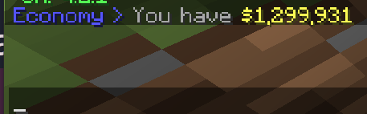

# Capitalism

Basic documenation and usage guide.

## Quick start
The goal is to be the first to reach **$1,000,000,000**.
The first time you connect, you will recieve **$1,000,000**.

There are a few ways to make money, they go as follows.
## Shops (not implemented yet)
If you buy an area of land (in the shop district) and decide to put a sign with a specific format (details TBD) on a chest, you can sell in-game items to other players for a set price.

## Playtime rewards
Every ~25 minutes, the server broadcasts a playtime reward. If you click the message, you get **$100,000**. You have 30 seconds to click the message, else it expires.

## Lottery
Every (timeframe not determined) minutes, the server broadcasts a lottery. If you click the message, you are entered. You also get notified about an active lottery whenever you log in. The maximum amount of money that a lottery can give is **$1,000,000**. Details about how the amount of money in a lottery is determined later.

# Specifics
More specific information.

## Commands
### /balance
Can also be typed as
 - bal

This will display how much money you have. Example:

### /pay
Can also be typed as
 - send
 - transfer

This command can be used in one of two formats.
 - /pay \<player> \<amount>
 - /pay \<amount> \<player>

A successful transaction looks like this

The text in brackets (in this case: `(ba7b)`), is the *transaction hash*. As the recipient of the money is not told who sent it, this hash is shared between both clients, so it can be used to confirm if someone sent you a transaction.

There are a few errors that can happen when trying to send someone money, the most common error is this

This means you don't have enough money to send to the specific player. But other errors include but are not limited to:
 - Sending money to yourself
 - Sending money under $1
 - General database issue
 - Causing a flag in anti money duplication systems

Please note that you cannot view the balance of another player.

## The Lottery
The server stores it's own bank account. This bank account is sent money from Death Tax (TBD), Transaction Tax (TBD), and property sales.

Everyday, **at around 5-6PM AEST**. The lottery will randomly select a winner out of the people who have entered. **You need to be online when it rolls for it to select you, it does NOT select an offline player**.

A roll is skipped if
- Less than 2 people rolled
- No one who entered is online
- The servers bank is too poor to afford a lottery

If a roll is skipped, you will have to wait until the next day for it to re-roll.

This is what a lottery notification looks like

"How does this message appear"? It appears in one of two ways
- When you connect to the server when there's an active lottery you haven't entered
- The moment after the lottery rolls (if the bank can afford it)

Make sure you open chat and click it so you don't miss it!

## How can I be added to the whitelist?
DM **jayphen#6666**.

## Bug Bounty

If you report a bug, you will be sent a fair, large sum of money, depending on what the issue is. The most important issues I care about are related to money duplication.

DM **jayphen#6666** on Discord for further information.

## Rules
The most important, and most general rule is "don't be an idiot". Chances are if you have to ask if something is against the rules, it is. But some trivial examples are as follows
 - Griefing
 - Stealing
 - Killing without reason
 - Exploiting
 - Cheating